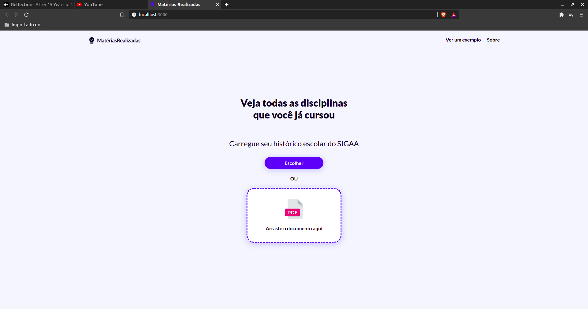
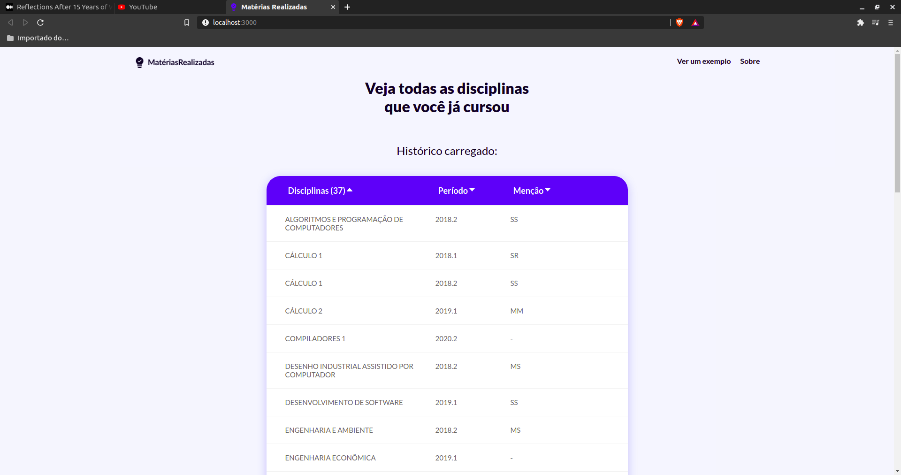
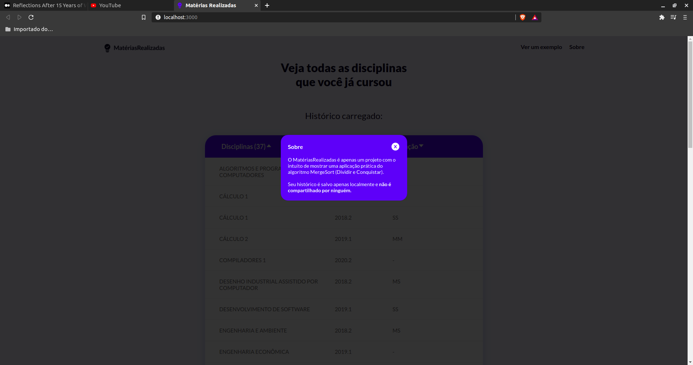

# Matérias Realizadas

**Número da Lista**: 2<br>
**Conteúdo da Disciplina**: Dividir e Conquistar<br>

## Alunos
|Matrícula | Aluno |
| -- | -- |
| 18/0114689 |  Tiago Samuel Rodrigues |
| 18/0113666 |  Ítalo Álves Guimarães |

## Sobre 
Este projeto tem como objetivo ordenar as matérias realizadas pelo usuário, ignorando as reprovações de matérias. Foi utilizado o algoritmo de merge sort, porém com uma implementação customizada para apagar objetos duplicados. 

## Screenshots




## Instalação 
**Linguagem**: Javascript<br>
**Framework**: ReactJS<br>

## Requisitos
npm ou yarn

## Como rodar
1) Navegue até a pasta frontend e rode
```
npm install
npm start
```
ou
```
yarn
yarn start
```

2) Abra outro terminal e navegue até a pasta backend e rode
```
npm install
npm start
```
ou
```
yarn
yarn start
```

## Uso 
Explique como usar seu projeto caso haja algum passo a passo após o comando de execução.


